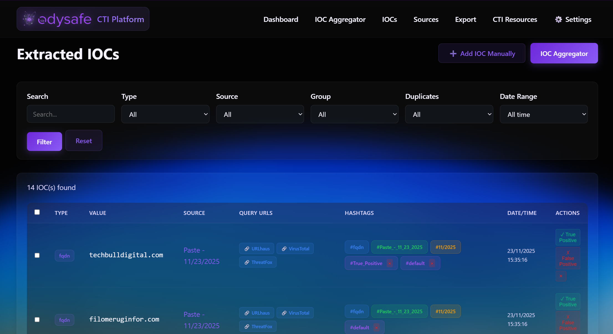

# 🛡️ ODYSAFE CTI Platform - Open Source Threat Intelligence

**🕸️ STIX 2.1 Graph Analyzer • 🔍 50+ IOC Types • 📤 8 Export Formats**  
**💾 SQLite Database • 🔒 ISO 27001/NIS2 Compliant • 🌐 Offline-First**

Centralize your IOCs, visualize threats with STIX 2.1, and export to your security tools.

---

## 📑 Table of Contents

- [Why ODYSAFE-CTI?](#-why-odysafe-cti)
- [STIX 2.1 - Featured Capability](#️-stix-21---featured-capability)
- [Quick Install (5 minutes)](#-quick-install-5-minutes)
- [IOC Extraction (50+ Types)](#-ioc-extraction-50-types)
- [Export Formats](#-export-formats)
- [CTI Resources](#-cti-resources)
- [Features Overview](#-features-overview)
- [Architecture](#-architecture)
- [Security & Compliance](#-security--compliance)
- [Privacy & Offline Operation](#-privacy--offline-operation)
- [Logs & Observability](#-logs--observability)
- [Roadmap](#-roadmap)
- [License](#-license)

---

## 🎯 Why ODYSAFE-CTI?

### 🔥 Key Advantages

- 🕸️ **STIX 2.1 Graph Analyzer** : Unique interactive visualization of threat relationships
- 📤 **STIX 2.1 Export** : Industry-standard format for professional CTI sharing
- 🔍 **50+ IOC Types** : Advanced automatic extraction from multiple sources
- 💾 **Lightweight SQLite** : 500MB footprint, no external database server required
- 🔒 **ISO 27001/NIS2 Ready** : Compliance-ready out of the box
- 🌐 **Offline-First** : Fully functional without internet connection
- ⚡ **5-Minute Setup** : Automated installation script
- 🆓 **100% Free & Open Source** : AGPL-3.0 licensed

### 🎯 Perfect For

- **SOC Analysts** : Visualize threats with STIX graphs, export to SIEM
- **DFIR Teams** : Extract IOCs from reports, analyze relationships
- **CERT/CSIRT** : Share standardized STIX 2.1 with partners
- **Security Admins** : Export blocklists to firewalls and EDR systems
- **Small Teams** : Lightweight solution with zero licensing costs
- **Sensitive Environments** : Air-gapped operation, no telemetry

---

## 🕸️ STIX 2.1 - Featured Capability

**Visualize and analyze your threats using the professional STIX 2.1 standard**


### ✨ STIX Capabilities

- **Interactive Network Visualization** : Explore threat objects and their relationships in an interactive graph
- **Filter by STIX Object Types** : Indicators, Threat Actors, Malware, Campaigns, Attack Patterns, and more
- **Relationship Exploration** : Understand connections between threats, actors, and indicators
- **Multiple Import Methods** : Import STIX bundles from files, platform exports, or paste JSON directly
- **Timeline View** : Temporal analysis of threat activities
- **Professional Export** : Generate STIX 2.1 bundles for sharing with CERT/CSIRT and integration with other CTI platforms

### 🎯 Complete STIX Workflow

1. **Import** : Load STIX bundles from your threat intelligence sources
2. **Visualize** : Interactive graph shows relationships between threat objects
3. **Analyze** : Explore connections, filter by type, examine object properties
4. **Export** : Share STIX 2.1 bundles with partners and security tools


**STIX 2.1 is the industry standard** for structured threat intelligence exchange. ODYSAFE-CTI Platform provides a complete STIX workflow from import to visualization to export, making it easy to work with threat intelligence in the format used by major security organizations worldwide.

---

## ⚡ Quick Install (5 minutes)

### Prerequisites

**Compatible Operating Systems:**
- Debian
- Ubuntu

**Requirements:**
- Python 3.8 or higher
- 500 MB minimum disk space
- systemd
- git
- pip
- **Root privileges** - Required for installation

### Installation

```bash
# Install git if not already installed
sudo apt install git -y

# Clone the repository
git clone https://github.com/Odysafe/ODYSAFE-CTI.git
cd ODYSAFE-CTI

# Run the installation script
./install.sh
```

> **Note:** The installation script requires **root privileges** to configure systemd services, create service users, and set up SSL certificates.

The installation script automatically configures everything: dependencies, Python environment, systemd service, and SSL certificate.


**Access the application:**
- Local: `https://localhost:5001`
- Network: `https://<SERVER_IP>:5001`

---

## 🔍 IOC Extraction (50+ Types)

**Automatically detect and extract 50+ types of Indicators of Compromise**



### 📋 Supported IOC Types

**Network Indicators:**
- IPv4, IPv6, IPv4 Subnet, Domain, FQDN, URL, ASN, Tor v3 Address

**File Indicators:**
- MD5, SHA1, SHA256, SHA512, File Path, File Name, Mutex, Registry Key

**Communication:**
- Email Address, Phone Number, User Agent

**Blockchain Addresses:**
- Bitcoin, Bitcoin Cash, Cardano, Dashcoin, Dogecoin, Ethereum, Litecoin, Monero, Ripple, Solana, Stellar, Tezos, Tron, Zcash

**Social Media Handles:**
- Facebook, GitHub, Instagram, LinkedIn, Pinterest, Telegram, Twitter, WhatsApp, YouTube, YouTube Channel

**Identifiers:**
- CVE, MITRE ATT&CK Technique (TTP), UUID, Android Package Name, Amazon Resource Name (ARN)

**Financial:**
- IBAN (Bank Account), WebMoney

**Legal & Compliance:**
- Copyright, Trademark, Chinese ICP License, Spanish NIF

**Other:**
- TOX Identifier

All IOC types are automatically detected, including defanged indicators (e.g., `hxxp://example[DOT]com`).

### 📥 Import Methods

**1. File Upload**
- Supported formats: `.txt`, `.html`, `.htm`, `.docx`, `.doc`, `.csv`, `.json`, `.log`, `.xml`, `.md`
- Maximum file size: 100 MB
- Automatic IOC extraction via **[iocsearcher](https://github.com/malicialab/iocsearcher)**

**2. URL Import**
- Fetch content from URLs automatically
- Extract IOCs from web pages and reports
- Preserve source context

**3. Text Paste**
- Paste text directly into the interface
- Instant IOC detection
- Supports defanged indicators

**4. Manual Entry**
- Add IOCs manually with full metadata
- Custom source attribution


---

## 📤 Export Formats

**8 professional export formats for all your security tools**

| Format | Description | Compatible With |
|--------|-------------|----------------|
| **STIX 2.1** ⭐ | Industry-standard threat intelligence format | CERT/CSIRT, SIEM, CTI platforms, MISP, OpenCTI |
| **TXT Simple** | Values only, one per line | Firewalls, EDR systems, proxies, blocklists |
| **CSV Firewall** | Simplified format for network equipment | Palo Alto, Cisco, Fortinet, Check Point |
| **CSV** | Detailed format with full metadata | Excel, data analysis tools, reporting |
| **JSON** | Complete internal format with all metadata | APIs, custom integrations, automation |
| **JSON Simple** | Simplified format grouped by IOC type | Lightweight integrations, scripts |
| **XLSX** | Excel format with formatted report | Presentations, reports, documentation |
| **TXT** | Text format with IOC types | General purpose, documentation |

**Export Features:**
- Filter by sources, groups, IOC types, and date ranges
- Bulk export operations
- Scheduled exports (via API)
- Full audit trail in exports


---

## 🌐 CTI Resources

**Access integrated threat intelligence resources from the deep and dark web**

The platform integrates three major CTI resource collections:

### 📚 DeepDarkCTI

- **1000+ CTI sources** from the Deep and Dark Web
- Organized by threat categories
- Browse, search, and add sources directly
- Favorites system for quick access
- Automatic repository updates

### 🦠 Ransomware Tool Matrix

- Comprehensive resources on ransomware tools, groups, and community reports
- Documentation of tools used by ransomware gangs
- Community reports and threat intelligence
- Search and filter capabilities

### 🛡️ Data-Shield IPv4 Blocklist

- Malicious IPv4 addresses blocklist
- Designed for firewall and WAF protection
- Regular updates from community sources
- Direct import to platform


**Integrated Resources:**
- **[deepdarkCTI](https://github.com/fastfire/deepdarkCTI)** : Open-source collection of CTI sources
- **[Ransomware Tool Matrix](https://github.com/BushidoUK/Ransomware-Tool-Matrix)** : Comprehensive ransomware intelligence
- **[Data-Shield IPv4 Blocklist](https://github.com/duggytuxy/Data-Shield_IPv4_Blocklist)** : Network protection blocklist

---

## ✅ Features Overview

| Feature | Description | Status |
|---------|-------------|--------|
| **STIX 2.1 Graph Analyzer** | Interactive visualization of STIX bundles | ✅ **Available** |
| **STIX 2.1 Export** | Industry-standard threat intelligence format | ✅ **Available** |
| **50+ IOC Types** | Automatic detection and extraction | ✅ Available |
| **IOC Extraction** | From files, URLs, text via iocsearcher | ✅ Available |
| **8 Export Formats** | TXT, CSV, JSON, XLSX, STIX 2.1 | ✅ Available |
| **CTI Resources** | DeepDarkCTI, Ransomware Matrix, Data-Shield | ✅ Available |
| **Tags & Groups** | Organize and classify IOCs | ✅ Available |
| **Bulk Operations** | Delete, tag, group multiple IOCs | ✅ Available |
| **Source Management** | Track sources, favorites system | ✅ Available |
| **Offline Operation** | Fully functional without internet | ✅ Available |
| **Authentication** | Optional user authentication | ✅ Available |
| **Storage Monitoring** | Automatic cleanup and monitoring | ✅ Available |
| **Audit Trail** | Complete IOC lifecycle tracking | ✅ Available |
| **ISO 27001/NIS2** | Compliance-ready features | ✅ Available |
| **Automatic IOC Enrichment** | External threat intelligence integration | 🔄 Coming soon |
| **Multi-source Correlation** | Identify relationships between IOCs | 🔄 Coming soon |
| **YARA/Sigma Rules** | Detection rule management | 🔄 Coming soon |

---

## 🎯 Key Capabilities

| Need | Solution | Status |
|------|----------|--------|
| **🪶 Lightweight platform running on Linux** | **SQLite database**, minimal memory footprint, local processing. Runs efficiently on minimal servers (**500 MB disk**, Python 3.8+). | ✅ Validated |
| **📥 Extract and centralize all IOCs from various sources** | **Automatic extraction** from files (Word, HTML, text) via iocsearcher, **URL import**, **text paste**, and **manual entry**. Centralized SQLite database with source management. | ✅ Validated |
| **🔍 Extract IOCs from a website, DFIR report, or copy-paste** | Multiple import methods: **URL import**, **file upload** (Word, HTML, text), and **text paste**. Automatic IOC detection via iocsearcher (**IPs, domains, hashes, URLs**). | ✅ Validated |
| **🕸️ Visualize and analyze STIX bundles** | **STIX Graph Analyzer**: interactive network visualization of STIX 2.1 bundles using vis.js. Import from files, exports, or paste. Filter by type, explore relationships. | ✅ Validated |
| **📤 Export IOCs to specific security solutions** | **8 export formats**: TXT, TXT Simple (firewall/EDR), CSV, CSV Firewall, JSON, JSON Simple, XLSX, **STIX 2.1**. **Filtered exports** by sources, groups, types, dates. | ✅ Validated |
| **🌐 Threat intelligence monitoring via quality, up-to-date resources** | Integrated **DeepDarkCTI** (hundreds of CTI sources), **Ransomware Tool Matrix**, and **Data-Shield IPv4 Blocklist**. Browse, search, add sources, **favorites system**. Automatic repository updates. | ✅ Validated |
| **🏷️ Organize and classify IOCs by threat type and priority** | Tagging system (**custom tags**, **TLP classification**, status tracking), **custom groups**, **bulk operations** for efficient management. | ✅ Validated |
| **📊 Maintain audit trail and track IOC lifecycle** | Complete history: **first_seen, last_seen**, source attribution, change history. **Full audit information** in exports for compliance. | ✅ Validated |
| **🔒 Operate offline or in air-gapped environments** | **Offline-first**: all processing happens locally. SQLite database on your server. **No telemetry**. Internet only for optional features when explicitly requested. | ✅ Validated |
| **🗄️ Manage storage and cleanup automatically** | **Storage monitoring**, automatic cleanup of old sources/IOCs, **configurable retention policies**, trash system with recovery, manual cleanup tools. | ✅ Validated |
| **🔐 Secure access control and session management** | **Optional authentication**, secure session management (HTTP-only cookies, SSL support), **dedicated service user**, secure data handling. | ✅ Validated |

---

## 🏗️ Architecture

```
┌─────────────────────────────────────────────────────────┐
│                    Web Interface (Flask)                 │
│  ┌──────────┐  ┌──────────┐  ┌──────────┐  ┌──────────┐ │
│  │   IOCs   │  │  STIX    │  │  Export  │  │   CTI    │ │
│  │  Manager │  │  Graph   │  │  Engine  │  │ Resources│ │
│  └──────────┘  └──────────┘  └──────────┘  └──────────┘ │
└──────────────────────┬──────────────────────────────────┘
                       │
┌──────────────────────▼──────────────────────────────────┐
│              SQLite Database (cti_platform.db)             │
│  ┌──────────┐  ┌──────────┐  ┌──────────┐  ┌──────────┐ │
│  │ Sources  │  │   IOCs   │  │   Tags   │  │  Groups  │ │
│  └──────────┘  └──────────┘  └──────────┘  └──────────┘ │
└──────────────────────┬──────────────────────────────────┘
                       │
┌──────────────────────▼──────────────────────────────────┐
│                    Export Formats                         │
│  STIX 2.1 • TXT • CSV • JSON • XLSX                      │
└──────────────────────┬──────────────────────────────────┘
                       │
┌──────────────────────▼──────────────────────────────────┐
│              Security Tools Integration                   │
│  Firewalls • SIEM • EDR • CERT/CSIRT • CTI Platforms     │
└──────────────────────────────────────────────────────────┘
```

**Key Components:**
- **Web Interface** : Flask-based modern UI
- **Database** : SQLite for lightweight operation
- **IOC Extraction** : iocsearcher integration
- **STIX Processing** : Full STIX 2.1 support
- **Export Engine** : 8 format support
- **CTI Resources** : Integrated repositories

---

## 🔒 Security & Compliance

### ✅ ISO 27001 & NIS2 Compliance

ODYSAFE-CTI Platform addresses specific requirements for ISO 27001 and NIS2 compliance:

| Framework / Requirement | Objective | How ODYSAFE-CTI Contributes |
|-------------------------|-----------|----------------------------|
| **ISO 27001:2022 Control 5.7 - Threat Intelligence** | Collect, analyze, and produce threat intelligence to guide security decisions. | **IOC Centralization Platform**: import, extraction, organization by tags, and integrated sources (DeepDarkCTI). **STIX 2.1 export** for standardized sharing. |
| **NIS2 - Risk Management (Art. 21)** | Adopt a risk management approach based on continuous threat analysis. | **Input Data for Risk Analysis**: Provides a centralized view of relevant IOCs to assess threats. **STIX visualization** for threat relationship analysis. |
| **NIS2 - Incident Management (Art. 23)** | Detect, manage, and notify incidents within strict timeframes (24h/72h). | **IOC Lifecycle Tracking**: Tagging system (`Investigating`, `Verified`, `False Positive`) and audit history. **STIX 2.1 export** for incident documentation. |
| **NIS2 - Information Sharing & Collaboration (Art. 23)** | Share threat information with authorities and partners. | **Structured Exports**: **STIX 2.1** format facilitating sharing with CERT/CSIRT and integration into other security tools. |
| **ISO 27001:2022 A.8.16 - Monitoring Activities** | Monitor systems to detect unauthorized activities and security events. | **Logging and Audit**: Logs via `journald` and complete audit trail for actions on IOCs. |
| **Offline Operation / Resilience** | Function in secure environments or with low connectivity. | **"Offline-First" Design**: Local processing, SQLite database, no telemetry. Aligns with the principle of resilience. |

### 🔐 Security Features

- **SSL/TLS** : Automatic certificate generation, HTTPS by default
- **Authentication** : Optional user authentication with secure sessions
- **Session Management** : HTTP-only cookies, secure cookie flags
- **Dedicated Service User** : Runs as non-root user with limited privileges
- **Systemd Security** : NoNewPrivileges, PrivateTmp, ProtectSystem
- **Data Privacy** : All data stays on your server, no telemetry

---

## 🔒 Privacy & Offline Operation

Odysafe CTI Platform operates **offline by default**. All processing, IOC extraction, tagging, and exports happen locally without sending information to external services.

### Internet Connections

The application connects to the Internet **only** in these specific cases:

1. **User-provided URL processing** : Only when you explicitly provide a URL
2. **CTI Resources repositories** : Only when you click "Download" or "Update" in CTI Resources (DeepDarkCTI, Ransomware Tool Matrix, or Data-Shield)
3. **Python package installation** : During initial installation via pip (iocsearcher and other dependencies from PyPI)
4. **vis.js library** : Loaded from CDN for STIX Graph visualization (can be used offline after initial load if cached)

**Note**: After initial installation, the application can operate **completely offline**. All Python dependencies are installed locally in the virtual environment, and no automatic updates or background connections are made.

### Data Privacy Guarantees

- ✅ All IOC data, sources, tags, and exports remain on your server
- ✅ No telemetry, analytics, or statistics are sent
- ✅ No automatic updates or background connections
- ✅ All processing (iocsearcher) runs locally
- ✅ The SQLite database and all files stay within your infrastructure

### Running Completely Offline

To operate in an air-gapped environment:

1. Skip the CTI Resources repositories download during installation
2. Do not use the "Download" or "Update" buttons in CTI Resources
3. Do not use the URL import feature - use file upload or text paste instead
4. For STIX Graph, ensure vis.js is available (loaded from CDN or use offline version)

All other features (IOC extraction from files, tagging, exports, authentication, STIX processing) work without an Internet connection.

---

## 📚 Logs & Observability

View application logs with these commands:

```bash
# View logs
sudo journalctl -u odysafe-cti-platform

# Follow logs in real-time
sudo journalctl -u odysafe-cti-platform -f

# Logs from the last hour
sudo journalctl -u odysafe-cti-platform --since "1 hour ago"

# Clean old logs
sudo journalctl --vacuum-time=7d
sudo journalctl --vacuum-size=100M
```

The journald configuration automatically limits log size (500 MB max, 30 days retention, daily rotation).

---

## 🚀 Roadmap

### ✅ Currently Available

- ✅ STIX 2.1 Graph Analyzer with interactive visualization
- ✅ STIX 2.1 export and import
- ✅ 50+ IOC types automatic extraction
- ✅ 8 export formats (TXT, CSV, JSON, XLSX, STIX 2.1)
- ✅ CTI Resources integration (DeepDarkCTI, Ransomware Matrix, Data-Shield)
- ✅ Offline-first operation
- ✅ ISO 27001/NIS2 compliance features

### 🔄 Coming Soon

- **Automatic IOC Enrichment** : Automated enrichment of IOCs using external threat intelligence sources (VirusTotal, etc.)
- **Multi-source Correlation** : Identify relationships between IOCs from different sources
- **YARA and Sigma Rules Management** : Create, optimize, and correct detection rules for threat detection

These enhancements will further strengthen the platform's capabilities in threat intelligence analysis and detection rule management.

---

## 🛠️ External Resources and Tools

This platform uses the following open-source tools and resources as dependencies:

- **[iocsearcher](https://github.com/malicialab/iocsearcher)** : Used for automatic IOC extraction from files
- **[deepdarkCTI](https://github.com/fastfire/deepdarkCTI)** : Used as a source of CTI resources from the deep and dark web
- **[Ransomware Tool Matrix](https://github.com/BushidoUK/Ransomware-Tool-Matrix)** : Used as a source of comprehensive ransomware tools, groups and community reports
- **[Data-Shield IPv4 Blocklist](https://github.com/duggytuxy/Data-Shield_IPv4_Blocklist)** : Used as a source of malicious IPv4 addresses for firewall and WAF protection
- **[vis.js](https://visjs.org/)** : Used for interactive network visualization in STIX Graph Analyzer

These tools and resources are integrated into the platform to provide their respective functionalities.

Odysafe CTI Platform thanks the developers and maintainers of these open-source projects for making their tools and resources available to the community.

---

## 📝 License

**GNU Affero General Public License v3.0 (AGPL-3.0)**

This program is free software: you can redistribute it and/or modify it under the terms of the GNU Affero General Public License as published by the Free Software Foundation, either version 3 of the License, or (at your option) any later version.

See the `LICENSE` or `COPYING` files for more details.

---

**Developed with ❤️ by Odysafe**
