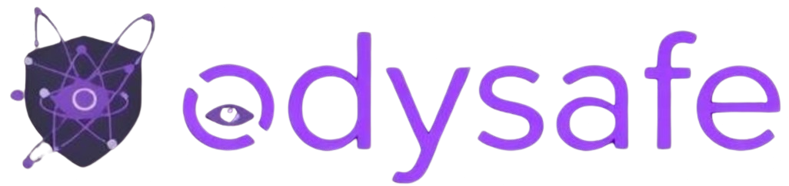
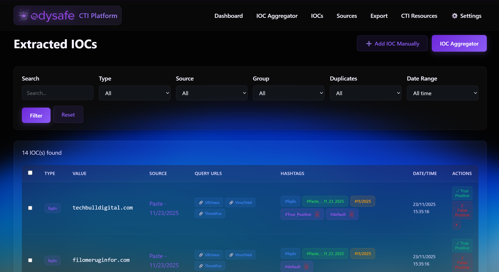

# 🛡️ Odysafe CTI Platform



## 📑 Table of Contents

- [Introduction](#-introduction)
- [Web Interface](#-web-interface)
- [Features](#-features)
- [Key Capabilities](#-key-capabilities)
- [Quick Install](#-quick-install)
- [IOC Extraction](#-ioc-extraction)
- [CTI Resources](#-cti-resources)
- [Home Interface](#-home-interface)
- [Export Functionality](#-export-functionality)
- [PDF Analysis](#-pdf-analysis)
- [ISO 27001 & NIS2 Compliance](#-iso-27001--nis2-compliance)
- [Privacy and Offline Operation](#-privacy-and-offline-operation)
- [Logs and Observability](#-logs-and-observability)
- [Roadmap](#-roadmap)
- [License](#-license)

---

## 🎯 Introduction

Odysafe CTI Platform is an on-premise solution to extract, organize, and enrich your IOCs (Indicators of Compromise).

It centralizes all your threat intelligence work in a simple web interface. You can import files, paste text, or manually enter IOCs. The platform automatically extracts them, organizes them with tags and groups, then exports them in various formats.

**Designed to be lightweight** 🚀

The application is specifically designed to be lightweight and function efficiently on minimal Linux servers without requiring extensive resources. It uses a SQLite database, runs with minimal memory footprint, and processes data locally without heavy external dependencies. Perfect for small teams or resource-constrained environments where performance and simplicity are key priorities.

**External Resources and Tools** 🔧

This platform uses the following open-source tools and resources as dependencies:
- **[iocsearcher](https://github.com/malicialab/iocsearcher)** : used for automatic IOC extraction from files
- **[deepdarkCTI](https://github.com/fastfire/deepdarkCTI)** : used as a source of CTI resources from the deep and dark web
- **[txt2stix](https://github.com/fastfire/txt2stix)** : used for conversion to STIX 2.1 format
- **[pdfalyzer](https://github.com/michelcrypt4d4mus/pdfalyzer)** : used for PDF analysis with colors and YARA rules
- **[Ransomware Tool Matrix](https://github.com/BushidoUK/Ransomware-Tool-Matrix)** : used as a source of comprehensive ransomware tools, groups and community reports

These tools and resources are integrated into the platform to provide their respective functionalities.

Odysafe CTI Platform thanks the developers and maintainers of these open-source projects for making their tools and resources available to the community.

---

## 🖥️ Web Interface



The web interface allows you to view, filter, and manage all your IOCs easily. You can tag them, group them, and export them with a few clicks.

---

## ✅ Features

| Feature | Available |
| --- | --- |
| Import files, URLs, or pasted text | ✅ |
| Manual IOC entry | ✅ |
| Automatic IOC extraction (iocsearcher) | ✅ |
| Tags, groups, and history | ✅ |
| Export formats: TXT, TXT simple, CSV, CSV firewall, JSON, JSON simple, XLSX, STIX 2.1 | ✅ |
| Authentication and session protection | ✅ |
| Background pipelines and cleanup | ✅ |
| Journald log rotation | ✅ |
| PDF analysis with YARA rules and structure visualization | ✅ |
| CTI Resources browsing (DeepDarkCTI, Ransomware Tool Matrix) | ✅ |
| Source management and favorites | ✅ |
| Bulk operations (delete, tag, group) | ✅ |
| Storage monitoring and cleanup | ✅ |
| Automatic IOC enrichment for malicious indicators | Coming soon |
| Multi-source correlation to identify relationships between IOCs | Coming soon |
| YARA and Sigma rules management for detection rule creation, optimization, and correction | Coming soon |

## 🎯 Key Capabilities

| Need | Solution | Status |
|------|----------|--------|
| **🪶 Lightweight platform running on Linux** | **SQLite database**, minimal memory footprint, local processing. Runs efficiently on minimal servers (**500 MB disk**, Python 3.8+). | ✅ Validated |
| **📥 Extract and centralize all IOCs from various sources** | **Automatic extraction** from files (PDF, Word, HTML, text) via iocsearcher, **URL import**, **text paste**, and **manual entry**. Centralized SQLite database with source management. | ✅ Validated |
| **🔍 Extract IOCs from a website, DFIR report, or copy-paste** | Multiple import methods: **URL import**, **file upload** (PDF, Word, HTML, text), and **text paste**. Automatic IOC detection via iocsearcher (**IPs, domains, hashes, URLs**). | ✅ Validated |
| **🔬 Investigate identified IOCs (e.g., VirusTotal)** | Complete IOC metadata (**first_seen, last_seen**, source context, audit trail). **Notes system** for investigation results. **Export to external analysis tools**. | ✅ Validated |
| **📤 Export IOCs to specific security solutions** | **8 export formats**: TXT, TXT Simple (firewall/EDR), CSV, CSV Firewall, JSON, JSON Simple, XLSX, STIX 2.1. **Filtered exports** by sources, groups, types, dates. | ✅ Validated |
| **🌐 Threat intelligence monitoring via quality, up-to-date resources** | Integrated **DeepDarkCTI** (hundreds of CTI sources) and **Ransomware Tool Matrix**. Browse, search, add sources, **favorites system**. Automatic repository updates. | ✅ Validated |
| **📄 Analyze a potentially malicious PDF** | PDF analysis via pdfalyzer: **YARA rule scanning**, **structure visualization**, font analysis, binary search. Identifies suspicious PDF elements. | ✅ Validated |
| **🏷️ Organize and classify IOCs by threat type and priority** | Tagging system (**custom tags**, **TLP classification**, status tracking), **custom groups**, **bulk operations** for efficient management. | ✅ Validated |
| **📊 Maintain audit trail and track IOC lifecycle** | Complete history: **first_seen, last_seen**, source attribution, change history. **Full audit information** in exports for compliance. | ✅ Validated |
| **🔒 Operate offline or in air-gapped environments** | **Offline-first**: all processing happens locally. SQLite database on your server. **No telemetry**. Internet only for optional features when explicitly requested. | ✅ Validated |
| **🗄️ Manage storage and cleanup automatically** | **Storage monitoring**, automatic cleanup of old sources/IOCs, **configurable retention policies**, trash system with recovery, manual cleanup tools. | ✅ Validated |
| **🔐 Secure access control and session management** | **Optional authentication**, secure session management (HTTP-only cookies, SSL support), **dedicated service user**, secure data handling. | ✅ Validated |

---

## ⚡ Quick Install

### Prerequisites

**Compatible operating systems:**
- Debian
- Ubuntu
- RHEL / CentOS
- Rocky Linux
- AlmaLinux
- Fedora
- Amazon Linux

**Requirements:**
- Python 3.8 or higher
- 500 MB minimum disk space
- systemd
- git
- pip
- **Root privileges** (#) - Required for installation

### Installation

```bash
git clone https://github.com/Odysafe/ODYSAFE-CTI.git
cd ODYSAFE-CTI
./install.sh
```

> **Note:** The installation script requires **root privileges** (#) to configure systemd services, create service users, and set up SSL certificates.

The installation script automatically configures everything: dependencies, Python environment, systemd service, and SSL certificate.


Once installed, access the application:
- Local: `https://localhost:5001`
- Network: `https://<SERVER_IP>:5001`

---

## 📋 IOC Extraction

You can extract IOCs simply by pasting text into the interface. The platform automatically detects all IOC types present.


**IOC Extraction**

Automatic IOC extraction is powered by **[iocsearcher](https://github.com/malicialab/iocsearcher)**, a library integrated into this platform that identifies IOCs in PDF, HTML, Word, and text files.

PDF analysis features use **[pdfalyzer](https://github.com/michelcrypt4d4mus/pdfalyzer)**, a tool integrated into this platform that enables in-depth visualization of PDF tree structures and scanning for potentially malicious content using YARA rules.

Odysafe CTI Platform thanks the iocsearcher and pdfalyzer projects for providing these valuable tools.

---

## 🌐 CTI Resources

The platform integrates access to CTI resources from the deep and dark web via the CTI Resources interface.


You can browse hundreds of CTI sources organized by categories and add them directly to your platform. The interface provides access to two main resources:

- **DeepDarkCTI** : Collection of cyber threat intelligence sources from the Deep and Dark Web
- **Ransomware Tool Matrix** : Comprehensive resources on tools, groups and community reports related to ransomware

**CTI Resources**

This feature integrates:
- **[deepdarkCTI](https://github.com/fastfire/deepdarkCTI)**, an open-source resource that collects and shares Cyber Threat Intelligence sources from the deep and dark web
- **[Ransomware Tool Matrix](https://github.com/BushidoUK/Ransomware-Tool-Matrix)**, an open-source resource that documents the tools used by ransomware gangs

These resources are integrated into the platform to provide access to CTI sources and ransomware intelligence.

Odysafe CTI Platform thanks the deepdarkCTI and Ransomware Tool Matrix projects for making these valuable resources available.

---

## 🏠 Home Interface

The home page provides a central dashboard for accessing all platform features.


---

## 📊 Export Functionality

Export your IOCs in various formats:

- **TXT** : Text format with IOC types
- **TXT Simple** : Values only, compatible with firewalls and EDR systems
- **CSV** : Detailed format with metadata (tags, groups, dates, sources)
- **CSV Firewall** : Simplified format compatible with firewalls and EDR systems
- **JSON** : Complete internal format with all metadata
- **JSON Simple** : Simplified format grouped by IOC type
- **XLSX** : Excel format with formatted report and color coding
- **STIX 2.1** : Standard threat intelligence format via txt2stix

Exports can be filtered by sources, groups, IOC types, and date ranges.


---

## 📄 PDF Analysis

Analyze suspicious PDF files with YARA-based detection and visualize PDF structure.


---

## 🧭 ISO 27001 & NIS2 Compliance

**ISO 27001:2022 Controls:**
- **A.9 Access Control**: Optional authentication, secured cookies, dedicated service user
- **A.12 Operations**: Automatic IOC workflows, log rotation, background cleanup, storage monitoring
- **A.14 System Acquisition & Development**: Locked dependencies, import verification, configuration templates
- **A.16 Incident Management**: Tagging system (False Positive, Investigating, Verified), report exports
- **A.18 Compliance**: SSL support, secret key management, log retention, audit documentation

**NIS2 Directive Alignment:**
- **Article 21 - Cybersecurity measures**: Centralized IOC management, threat classification, full traceability
- **Incident management**: IOC tracking and classification (True Positive, False Positive, Verified)
- **Threat intelligence**: Centralized IOC enrichment for rapid threat response
- **Reporting**: Structured exports (STIX 2.1) for threat information sharing
- **Operational resilience**: Offline operation, storage monitoring, secure data handling

---

## 🔒 Privacy and Offline Operation

Odysafe CTI Platform operates offline by default. All processing, IOC extraction, tagging, and exports happen locally without sending information to external services.

### Internet Connections

The application connects to the Internet only in these specific cases:

1. **User-provided URL processing** : only when you explicitly provide a URL
2. **CTI Resources repositories** : only when you click "Download" or "Update" in CTI Resources (DeepDarkCTI and Ransomware Tool Matrix)
3. **txt2stix external APIs** : optional, disabled by default, requires explicit configuration

### Data Privacy Guarantees

- All IOC data, sources, tags, and exports remain on your server
- No telemetry, analytics, or statistics are sent
- No automatic updates or background connections
- All processing (iocsearcher, txt2stix) runs locally
- The SQLite database and all files stay within your infrastructure

### Running Completely Offline

To operate in an air-gapped environment:

1. Skip the CTI Resources repositories download during installation
2. Do not use the "Download" or "Update" buttons in CTI Resources
3. Do not use the URL import feature - use file upload or text paste instead
4. Do not configure txt2stix external APIs or AI extractors

All other features (IOC extraction from files, tagging, exports, authentication) work without an Internet connection.

---

## 📚 Logs and Observability

View application logs with these commands:

```bash
# View logs
sudo journalctl -u odysafe-cti-platform

# Follow logs in real-time
sudo journalctl -u odysafe-cti-platform -f

# Logs from the last hour
sudo journalctl -u odysafe-cti-platform --since "1 hour ago"

# Clean old logs
sudo journalctl --vacuum-time=7d
sudo journalctl --vacuum-size=100M
```

The journald configuration automatically limits log size (500 MB max, 30 days retention, daily rotation).

---

## 🚀 Roadmap

The following features are planned for future releases:

These enhancements will further strengthen the platform's capabilities in threat intelligence analysis and detection rule management.

---

## 📝 License

GNU Affero General Public License v3.0 (AGPL-3.0)

See the `LICENSE` or `COPYING` files for more details.
