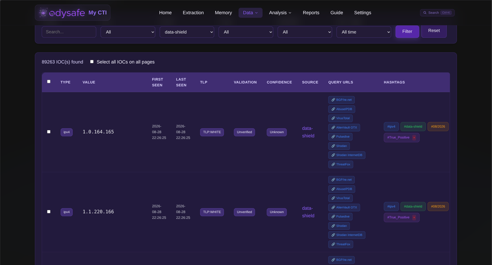
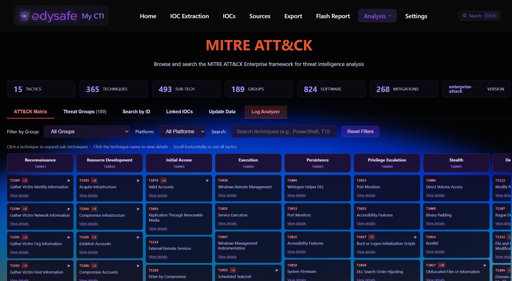

# ODYSAFE CTI Platform

**Open-source, on-premise Cyber Threat Intelligence platform.**
Extract IOCs, manage indicators, visualize STIX bundles, build Flash Reports, and export IOC data to standard formats. Fully offline after install. No admin rights needed to run. No licensing costs.

> Built for SOC analysts, DFIR teams, CERT/CSIRT, and consultants who need a lightweight, privacy-first CTI workspace for investigation sessions.

---

## What it does

- Extract 50+ IOC types from files, text, or URLs automatically
- Browse, filter, tag, and manage all your indicators from one view
- Manage and organize your CTI sources with groups
- Export IOCs to TXT, CSV, JSON, or XLSX (including firewall/EDR-ready value lists)
- Run an **Investigation** session: scope IOCs by group, review deliverables, and TTP coverage
- Use **Analysis** tools: CTI Memory, Log Analyzer, STIX Graph, MITRE ATT&CK, DeepDarkCTI, Ransomware Tool Matrix
- Generate structured **Flash Reports** with Excel export (dashboard, charts, Diamond Model diagram)
- Search across IOCs, sources, MITRE ATT&CK, and CTI Memory from anywhere in the app (Ctrl+K)
- Everything stays on your machine. No cloud. No telemetry.

---

## Application structure

The navigation bar is organized in five areas so related tools stay grouped:

| Area | Nav entry | What it contains |
|------|-----------|------------------|
| **Home** | Home | Dashboard, workspace statistics, quick links |
| **Data** | Data ▾ | IOC Extraction, IOCs, Sources, Export |
| **Investigation** | Investigation | Active session hub (scope, deliverables, TTP coverage) |
| **Analysis** | Analysis ▾ | Analysis hub, CTI Memory, Log Analyzer, STIX Graph, MITRE ATT&CK, DeepDarkCTI, Ransomware Tool Matrix |
| **Reports** | Reports | Flash Report (FLINT) |
| **Admin** | Settings | Authentication, storage, backup, cleanup |

**Suggested workflow:** open an Investigation session → collect IOCs under **Data** → analyze under **Analysis** → write a **Flash Report** → export IOCs → review deliverables and TTP coverage in **Investigation**.

---

## Screenshots






---

## Requirements

**Compatible OS:** Debian / Ubuntu

| Dependency | Details |
|------------|---------|
| Python | 3.10 or higher (3.10–3.12 tested in CI) |
| git | any recent version |
| pip | included with Python |
| openssl | any recent version |
| Disk space | ~500 MB base install; +~80 MB on first CTI Memory use (embedding model) |

---

## Installation and startup

**The only step that requires `sudo` is the initial system package install.** Everything after that runs as a normal user, no root, no admin rights needed.

**Step 1 - Install system packages (one time, requires sudo)**

```bash
sudo apt update
sudo apt install -y python3 python3-venv python3-pip git openssl
```

**Step 2 - Clone and install**

For reproducible installs, use a [release tag](https://github.com/Odysafe/ODYSAFE-CTI/releases) instead of the moving `main` branch:

```bash
git clone https://github.com/Odysafe/ODYSAFE-CTI.git
cd ODYSAFE-CTI
git checkout v1.0.0   # or the latest release tag
./install.sh
```

`./install.sh` sets up the Python virtual environment, installs locked dependencies when `scripts/requirements.lock` is present, generates the SSL certificate locally, and optionally downloads pinned CTI resource snapshots. No `sudo` needed.

Environment variables (optional):

| Variable | Default | Purpose |
|----------|---------|---------|
| `CTI_UPGRADE_PIP=1` | off on existing venv | Force `pip` upgrade during install |

**Step 3 - Start the application**

```bash
./start.sh
```

Then open **https://localhost:5001** in your browser.

The SSL certificate is auto-generated locally at first start. No external certificate authority is contacted.

**To uninstall** (removes venv, database, uploads, and cache):

```bash
./uninstall.sh
```

**Manual DeepDarkCTI setup** if you skipped it during install (uses the pinned commit in `scripts/pinned_sources.json`):

```bash
git clone https://github.com/fastfire/deepdarkCTI.git ODYSAFE-CTI/cti-platform/modules/deepdarkCTI-main
git -C ODYSAFE-CTI/cti-platform/modules/deepdarkCTI-main checkout $(python3 -c "import json; print(json.load(open('scripts/pinned_sources.json'))['deepdarkcti']['commit'])")
```

---

## Production deployment

| Practice | Why |
|----------|-----|
| Install from a **release tag**, not `main` | Stable, reviewable snapshot of the application |
| Use **`scripts/requirements.lock`** | Reproducible Python dependency tree (regenerate with `./scripts/refresh-lock.sh`) |
| Keep **`scripts/pinned_sources.json`** unchanged in production | MITRE, DeepDarkCTI, and Ransomware Matrix downloads stay at known commits |
| Enable **authentication** in Settings | Default install has no login; restrict access before exposing the service |
| Prefer **HTTPS** and restrict network exposure | Self-signed cert is fine internally; do not expose HTTP on untrusted networks |
| Run **air-gapped** when required | Skip optional downloads during install; avoid URL import and CTI resource refresh |
| Do not click **Refresh** on CTI resources in frozen environments | Refresh pulls upstream content; pinned installs only guarantee the initial snapshot |

To bump pinned third-party snapshots after review, edit `scripts/pinned_sources.json` and re-download resources from the UI or `./install.sh`.

---

## Where your data is stored

Everything stays inside the installation directory.

| Type | Location |
|------|----------|
| Uploaded files | `cti-platform/uploads/` |
| IOC exports | `cti-platform/outputs/iocs/` |
| Reports | `cti-platform/outputs/reports/` |
| SQLite database | `cti-platform/database/` |
| CTI Memory (ZettelForge) | `cti-platform/data/zettelforge/` |
| Cache | `cti-platform/modules/cache/` |
| SSL certificates | `cti-platform/ssl/` |

---

## Navigation

| Area | Page | Route | Purpose |
|------|------|-------|---------|
| Home | Dashboard | `/` | Workspace statistics and quick links |
| Data | IOC Extraction | `/upload` | Import IOCs from files, paste, URLs, or manual entry |
| Data | IOCs | `/iocs` | Browse, filter, tag, and manage indicators |
| Data | Sources | `/sources` | Manage import sources and groups |
| Data | Export | `/export` | Export filtered IOC data |
| Investigation | Investigation | `/investigation` | Session workspace, deliverables, TTP coverage |
| Analysis | Analysis hub | `/cti-toolkit` | Entry point for analysis modules |
| Analysis | CTI Memory | `/memory` | Semantic recall, entity graph, Sigma/YARA ingest (ZettelForge, no LLM) |
| Analysis | Log Analyzer | `/log-analyzer` | Upload logs and map events to MITRE techniques |
| Analysis | STIX Graph | `/stix-graph` | Interactive STIX 2.x bundle visualization |
| Analysis | MITRE ATT&CK | `/cti-resources/mitre-attack` | Enterprise matrix, groups, IOC links |
| Analysis | DeepDarkCTI | `/cti-resources/deepdarkcti` | Browse DeepDarkCTI source catalogs |
| Analysis | Ransomware Tool Matrix | `/cti-resources/ransomware-matrix` | Ransomware tools and group profiles |
| Reports | Flash Report | `/flash-report` | Build and export structured CTI reports |
| Admin | Settings | `/settings` | Authentication, storage, backup, and cleanup |

Legacy route `/intelligence` redirects to the Analysis hub (`/cti-toolkit`).

---

## Features

### IOC Extraction

Collect IOCs from four input methods:

- **File upload** - drag and drop or select a file: `.txt`, `.html`, `.htm`, `.docx`, `.doc`, `.csv`, `.json`, `.log`, `.xml`, `.md` (up to 100 MB)
- **Paste text** - paste any content directly, IOCs are extracted instantly
- **URL import** - provide a URL, the platform fetches the page and extracts IOCs
- **Manual entry** - add a single IOC with type, value, source name, and context

Defanged indicators like `hxxp://example[DOT]com` are detected and normalized automatically.

Each import creates a named source with a configurable source name and optional context. Source name fields suggest names from existing active sources (datalist).

**Quick Export:** extract IOCs from a file, paste, or URL and download immediately without saving to the database. Supported formats: TXT, CSV, JSON, XLSX (same as the Export page).

Powered by [iocsearcher](https://github.com/malicialab/iocsearcher).

**50+ IOC types detected automatically:**

| Category | Types |
|----------|-------|
| Network Indicators | URL, FQDN (Domain), IPv4, IPv6, IPv4 Subnet, Tor v3 Address |
| File Hashes | MD5, SHA1, SHA256 |
| Communication | Email Address, Phone Number |
| Blockchain | Bitcoin, Bitcoin Cash, Cardano, Dashcoin, Dogecoin, Ethereum, Litecoin, Monero, Ripple, Solana, Stellar, Tezos, Tron, Zcash |
| Social Media | Facebook, GitHub, Instagram, LinkedIn, Pinterest, Telegram, Twitter, WhatsApp, YouTube, YouTube Channel |
| Identifiers | CVE, MITRE ATT&CK TTP, UUID, Android Package Name, Amazon ARN |
| Financial | IBAN, WebMoney |
| Legal and Compliance | Copyright, Trademark, Chinese ICP License, Spanish NIF |
| Other | TOX Identifier |

---

### IOC Management

Browse and manage all extracted indicators from one view.

All IOCs are automatically tagged with their type, source, and extraction date.

**Filtering and search:**
- Full-text search across all IOC values
- Filter by type, source, group, date range, or duplicates
- Interactive hashtag filtering by type, source, date, and group
- Smart pagination for large lists

**Per IOC:**
- Mark as True Positive or False Positive
- Assign TLP level (CLEAR, GREEN, AMBER, RED)
- Set confidence level
- View first seen and last seen dates
- Add to a group
- Link to MITRE ATT&CK techniques (stored in `ioc_ttp_links`)

**Bulk actions:**
- Select multiple IOCs and apply bulk deletion or group assignment

**Manual addition:**
- Add individual IOCs with type, value, and context directly from the IOC list
- Optional MITRE ATT&CK technique search (autocomplete via `/api/mitre-attack/search`); links the IOC to the technique on save

**One-click enrichment links per IOC:**
- [BGP.he.net](https://bgp.he.net)
- [AbuseIPDB](https://www.abuseipdb.com)
- [VirusTotal](https://www.virustotal.com)
- [AlienVault OTX](https://otx.alienvault.com)
- [Pulsedive](https://pulsedive.com)
- [Shodan](https://www.shodan.io)
- [Shodan InternetDB](https://internetdb.shodan.io)
- [ThreatFox](https://threatfox.abuse.ch)

---

### Global Search

Press **Ctrl+K** (or click the search button in the navigation bar) to search across:

- **IOCs** - by value, with duplicate merging across sources
- **Sources** - by name or context
- **MITRE ATT&CK** - techniques and groups (when local ATT&CK data is installed)
- **CTI Memory** - semantic recall over stored analyst notes (when ZettelForge is installed)

Results link directly to the relevant page or detail view.

---

### Sources

Every import creates a source. Sources are the origin records tied to your IOCs.

- Organize sources into custom drag-and-drop groups
- View detailed statistics per source: IOC count, detected types, creation date
- Bulk selection and deletion
- Trash system with reversible deletion and configurable auto-cleanup
- Filter and sort sources by name, date, or IOC count
- View context and metadata for each source
- Extract IOCs from uploaded files including PDF reports (via iocsearcher)

**Data-Shield IPv4 Blocklist** is accessible directly from the Sources page. Refresh the blocklist or export it as firewall rules in one click.

---

### Investigation

Lightweight workspace for a single analysis session (`/investigation`). Three tabs:

**Session**
- Name, notes, and optional IOC group scope (one active session at a time)
- Snapshot: IOC count, true positives, linked TTPs, log analyses
- Quick links to extraction, scoped IOCs, export, Flash Report, Log Analyzer, MITRE
- Detects an in-browser Flash Report draft (`localStorage`)

**Deliverables**
- Lists files saved under `outputs/iocs/`, `outputs/stix/`, and `outputs/reports/` with download links
- Browser-downloaded Flash Report Excel files are not stored automatically

**TTP Coverage**
- Techniques linked to IOCs in scope (`ioc_ttp_links`, filtered by session group when set)
- Techniques matched in Log Analyzer events (`incident_events`)

Reuse an existing **group** to scope the session to a set of IOCs already in the platform.

---

### CTI Memory (ZettelForge)

Local semantic memory and knowledge graph at `/memory`. Powered by [ZettelForge](https://github.com/rolandpg/zettelforge) with **LLM disabled** — regex entity extraction, fastembed ONNX vectors, LanceDB, and co-occurrence graph only.

**Automatic indexing** (when `zettelforge` is installed):
- IOC source imports (upload, paste, URL) — full text or IOC list
- IOC analyst notes
- Investigation session saves
- Log Analyzer completed incidents
- Flash Report Excel exports

**Manual features:**
- **Recall** — semantic + exact blended search over stored notes
- **Entity lookup** — by IP, domain, hash, CVE, technique ID, threat actor
- **Graph traversal (BFS)** — walk co-occurrence links from an entity
- **Stats** — note counts and most referenced entity types
- **Sigma / YARA ingest** — parse rule files and link ATT&CK tags into the graph
- **Add note** — store free-form analyst text

**Global Search (Ctrl+K)** also returns matching memory entries.

Data is stored under `cti-platform/data/zettelforge/`. The embedding model (~80 MB) is downloaded once on first use; after that, operation is fully offline. Included in `scripts/requirements.txt` and installed by `./install.sh`.

---

### Export

Export IOC data from the database or via **Quick Export** on the IOC Extraction page (extract and download without saving to the database). Both paths support the same formats.

All exports respect active filters and can be scoped by IOC type, source, tag, group, or date range.

| Format | Use case |
|--------|----------|
| TXT (with types) | General purpose with IOC type labels |
| TXT Simple | Blocklists and EDR import: one value per line |
| CSV | Excel, reporting, data analysis with metadata |
| CSV Firewall | Simplified CSV with IOC values only |
| JSON | APIs, automation, custom integrations |
| JSON Simple | Lightweight scripts, grouped by IOC type |
| XLSX | Formatted Excel report for documentation |

Scope options: All IOCs, by Sources, by Tags, or by Groups.

The last 5 exports are listed on the Export page with direct download links.

**Note:** STIX bundle **visualization** is available in the STIX Graph module. There is no STIX IOC export route in the current release.

---

### Analysis

The **Analysis** hub (`/cti-toolkit`, also `/intelligence`) groups analysis and research modules. Access it from the **Analysis** menu in the navigation bar.

| Module | Route | Description |
|--------|-------|-------------|
| CTI Memory | `/memory` | Semantic recall, entity graph, Sigma/YARA ingest |
| Log Analyzer | `/log-analyzer` | Upload logs and map events to MITRE techniques |
| STIX Graph | `/stix-graph` | Interactive STIX 2.x bundle visualization |
| MITRE ATT&CK | `/cti-resources/mitre-attack` | Enterprise ATT&CK matrix, groups, IOC links |
| DeepDarkCTI | `/cti-resources/deepdarkcti` | Browse DeepDarkCTI source catalogs |
| Ransomware Tool Matrix | `/cti-resources/ransomware-matrix` | Ransomware tools, group profiles, community reports |

Investigation lives in the top-level **Investigation** nav entry (not duplicated in the Analysis hub).

---

### STIX Graph Analyzer

Import and visualize any STIX 2.x bundle in an interactive graph.

**Import options:**
- Upload a STIX JSON file
- Paste raw JSON
- Load previously uploaded STIX files
- Load a previously saved graph model

**Graph features:**
- Interactive network graph with zoom, pan, and click-to-inspect
- Filter visible nodes by STIX object type (Indicator, Malware, Threat Actor, Campaign, Attack Pattern...)
- Full-text search across nodes and relationships
- Temporal filtering with a slider to explore threat evolution over time
- Side panel with full object properties and connections on node click
- Save models for later analysis
- Export graph and data to various formats

**100% client-side.** All STIX data is processed locally in your browser. No data is sent to any server.

Based on [cti-stix-visualization](https://github.com/oasis-open/cti-stix-visualization) by OASIS TC Open Repository. All assets including vis-network are bundled locally with no CDN calls.

---

### DeepDarkCTI

Browse CTI source catalogs from the [deepdarkCTI](https://github.com/fastfire/deepdarkCTI) community repository. Source counts and categories depend on the installed repository version.

- Search and filter sources by name or category
- Add sources manually with URL, name, and description
- Mark sources as favorites
- Refresh the repository on demand

---

### MITRE ATT&CK Enterprise

Full ATT&CK enterprise matrix available locally when `enterprise-attack.json` is installed:

| Stat | Value |
|------|-------|
| Tactics | 15 |
| Techniques | 365 |
| Sub-techniques | 493 |
| Groups | 189 |
| Software | 824 |
| Mitigations | 268 |

Browse the full ATT&CK matrix by tactic column. Filter by group, by platform, or search by technique name or ID (e.g. `T1059`, `PowerShell`). Click any technique to expand sub-techniques and view details. Browse threat groups. Link IOCs from your database to specific techniques. Update the local ATT&CK data file from MITRE at any time.

**APT Research Base:** search threat actors and browse curated reference sources from the Neo23x0 annotations list. Refresh sources on demand, add manual entries, and mark favorites.

---

### Ransomware Tool Matrix

Tools, groups, and community reports on ransomware gangs. Search and filter by tool or group name. Download the repository on demand.

**Data-Shield IPv4 Blocklist**

Community-maintained malicious IPv4 list for firewall and WAF protection. Import to the platform in one click, refresh on demand, or export directly as firewall rules.

---

### Flash Report (FLINT)

Generate structured CTI reports and export them in Excel format.

The report follows a 13-step wizard:

1. Header and metadata: reference number (FLINT-YYYY-XXX), TLP (RED / AMBER / GREEN / CLEAR), PAP (RED / AMBER / GREEN / WHITE), priority (Critical / High / Medium / Low), status (Draft / Review / Final), author, created and updated dates
2. Subject
3. Summary
4. Key takeaways
5. Timeline
6. Analysis (Diamond Model fields: Adversary, Capability, Infrastructure, Victim)
7. IOCs
8. Detection rules
9. Actions
10. Gaps
11. Assessment
12. Sources
13. Distribution

**Workflow features:**
- Section progress tracking in the sidebar
- Draft banner with auto-save to browser localStorage
- Saved report history (localStorage)
- Import IOCs from the platform database or MITRE group search
- Import reference URLs from DeepDarkCTI favorites
- MITRE technique search for TTP fields
- Threat actor field: MITRE group datalist and contextual hint (techniques linked to the selected group, when ATT&CK data is available)

**Excel export** (`POST /flash-report/export`) produces a workbook with seven sheets:

| Sheet | Content |
|-------|---------|
| Dashboard | KPI cards, Diamond Model diagram, IOC/TTP/action charts |
| Executive Summary | Metadata, summary, CIA triad impact, takeaways, assessment |
| Technical Analysis | Diamond Model, attack details, TTP table |
| IOCs | Indicator table with optional defanging, type pie chart |
| Detection | Detection rules entered manually (Sigma, YARA, Snort, etc.) |
| Recommendations | Prioritized action items |
| Sources | Reference list |

---

### Log Analyzer

Upload security logs and automatically map events to MITRE ATT&CK techniques.

**Supported log formats:**
- CSV: SIEM exports, Windows Event exports, spreadsheet logs with headers
- JSON: AWS CloudTrail, Azure Activity Logs, API logs, structured SIEM events
- TXT / LOG: Syslog (RFC 3164/5424), Windows application logs, Apache/Nginx/IIS access logs, firewall logs, plain text
- XML: Windows Event Log exports

**How it works:**

Each log event is scanned against 200+ regex patterns covering all 14 MITRE ATT&CK tactics. Coverage includes endpoint activity (Windows, Linux), network events (firewall, proxy, DNS), web application logs (Apache, Nginx, IIS), Active Directory events, and cloud logs (AWS CloudTrail, Azure Activity). Keywords include `powershell`, `mimikatz`, `lsass`, `registry run key`, `lateral movement`, `dns tunneling`, `vssadmin`, `wbadmin`.

From each log line the system extracts:
- `timestamp` - parsed from the line itself (ISO 8601, Syslog, Windows Event format), falls back to upload time
- `source` - originating system or log type (firewall, sysmon, webserver, AD, cloud...)
- `description` - the full raw log message used for pattern matching
- `host` - hostname or IP of the machine involved, when present

**Signal strength per match:**
- High (>= 80%) - strong multi-keyword match on a high-severity tactic
- Medium (50-79%) - partial match or lower-severity tactic
- Low (< 50%) - weak single-keyword match

Signal strength reflects pattern confidence only, not the actual severity of the incident.

**Output:**
- Cyber Kill Chain visualization showing which phases had detected events and which are Blind Zones
- Detected technique cards with technique ID, name, tactic, and event count
- Chronological attack timeline grouped by MITRE tactic in Kill Chain order
- All Events table with timestamp, source, description, matched technique, and signal strength
- Export results to JSON or CSV
- Past analyses saved and accessible from the Past Incidents tab

Tactics with no detected events are marked as **Blind Zones**. Their absence does not confirm the attack skipped that phase.

> A match signals an area requiring investigation. It does not confirm a compromise. Manual analyst review is always required.

---

### Settings

**Authentication**
Enable or disable login. When enabled, users must authenticate to access the platform. Default credentials are configured during installation.

**Auto-tagging**
Automatically tag extracted IOCs based on their type, source, date, and other metadata. Manual tags remain available regardless of this setting.

**Source management**
- Enable automatic source rotation: when the maximum source count is reached, the oldest sources are deleted automatically
- Set the maximum number of sources to keep (default: 20)
- Set the number of recent sources shown on the dashboard (default: 20)
- Configure trash auto-cleanup delay in days (default: 5)
- Manually trigger trash cleanup at any time

**Storage monitoring**
- View total disk usage and free space with live refresh
- View space used by uploads, database, and outputs separately
- Manual cleanup controls:
  - Clean uploads (files, paste, URLs)
  - Clean outputs (TXT, JSON, CSV exports)
  - Delete all sources and their associated IOCs
  - Delete all IOCs from the database
  - Delete all STIX uploaded files
  - Full reset: deletes all uploads, outputs, IOCs, sources, groups, STIX files, log analyzer incidents, and cache

**Backup and restore (Settings → Backup & Restore, format v2.0)**
- ZIP export includes: IOCs (lifecycle fields, tags, groups), sources, tag catalog, MITRE IOC↔technique links, investigation sessions, Log Analyzer incidents, saved STIX Graph models, settings, groups, DeepDarkCTI and Ransomware Matrix favorites, and CTI Memory (ZettelForge) when present
- Restore merges into the existing workspace; duplicate IOCs refresh lifecycle metadata
- Not included: user passwords, uploaded files, output files on disk, Flash Report drafts saved in browser localStorage
- v1.0 backup ZIPs remain supported for IOCs, sources, groups, and settings

Settings are saved and applied immediately.

---

## Typical workflows

**Consultant investigation session**
1. Open **Investigation** → create a session and link an IOC group scope
2. **Data → IOC Extraction** → import reports (file, paste, or URL)
3. **Data → IOCs** → validate indicators (TP/FP, TLP, notes, MITRE links)
4. **Analysis** → MITRE ATT&CK, Log Analyzer, CTI Memory as needed
5. **Reports → Flash Report** → build and export Excel deliverable
6. **Data → Export** → export scoped IOC lists for the client
7. **Investigation** → review Deliverables and TTP Coverage before closing the session

**IOC triage only**
1. **Data → IOC Extraction** → import sources
2. **Data → IOCs** → filter, tag, deduplicate view
3. **Data → Export** → download blocklists or reports

**Log-driven analysis**
1. **Analysis → Log Analyzer** → upload logs, review Kill Chain and timeline
2. **Investigation → TTP Coverage** → compare log techniques with linked IOC TTPs
3. **Analysis → CTI Memory** → recall related past notes (when installed)

---

## Dashboard overview

The home page shows a live summary of your CTI workspace and quick links to Investigation, Data pages, Analysis hub, and Flash Report:

- Total sources and active IOC count
- True Positive / False Positive / unvalidated counts
- Temporal trends: IOCs and sources added in the last 24h / 7d / 30d
- Top 5 IOC types and distribution by category
- Quality and validation ratios
- TLP classification breakdown
- Operational metrics: IOCs with notes, IOCs with query URLs
- Alerts: critical IOCs (TLP:RED + True Positive), recent unvalidated, sources in error
- Most productive sources
- Recent sources list
- CTI Resources status (DeepDarkCTI last update, MITRE ATT&CK import status, Ransomware Matrix status, Data-Shield blocklist last update and IP count)

---

## Privacy and offline operation

After installation, the platform makes zero network connections by default.

| Action | Connection | Destination |
|--------|-----------|-------------|
| Normal usage | None | Everything is local |
| URL import | On demand | URL you provide |
| DeepDarkCTI download or refresh | On demand | github.com/fastfire/deepdarkCTI (pinned commit on first install) |
| Ransomware Matrix download | On demand | github.com/BushidoUK/Ransomware-Tool-Matrix (pinned commit on first install) |
| Data-Shield blocklist refresh | On demand | github.com/duggytuxy/Data-Shield_IPv4_Blocklist |
| MITRE ATT&CK update | On demand | raw.githubusercontent.com/mitre-attack/attack-stix-data (pinned commit by default) |
| APT Research Base refresh | On demand | Neo23x0 annotations.xml gist |
| CTI Memory embedding model (first use) | Once | HuggingFace model download for fastembed (~80 MB) |

All frontend assets including vis.js, CSS, and JavaScript are bundled locally. No CDN calls at runtime.

**To run fully air-gapped:**
- Skip CTI resource downloads during installation
- Do not use URL import; use file upload or paste text instead
- Do not click Download or Refresh in CTI Resources
- Pre-load the CTI Memory embedding model before disconnecting, or skip CTI Memory

**Data privacy:**
- All IOC data, sources, tags, and exports stay on your server
- No telemetry or analytics
- No automatic updates or background connections
- IOC extraction runs locally via iocsearcher
- The SQLite database and all files stay within your infrastructure

---

## Compliance

| Standard | Control | How ODYSAFE-CTI helps |
|----------|---------|----------------------|
| ISO 27001:2022 | Control 5.7 - Threat Intelligence | Centralized IOC management, STIX visualization, structured Flash Reports |
| NIS2 | Art. 21 - Risk Management | Centralized IOC view for threat assessment, STIX visualization |
| NIS2 | Art. 23 - Incident Management | IOC lifecycle tracking, tagging system, Flash Report workflow, log analysis |
| NIS2 | Art. 23 - Information Sharing | Structured Excel Flash Reports, exported IOC lists |
| ISO 27001:2022 | A.8.16 - Monitoring | Application logs to stdout, full audit trail in SQLite |

---

## Architecture

```
Browser (Jinja2 templates, vanilla JS, vis-network bundled locally)
                    |
              HTTPS localhost:5001
                    |
         Flask backend (Python)
         runs as normal user, no root needed
                    |
         SQLite database (single local file)
                    |
    IOCs / Sources / Flash Reports / Log Analyses / Exports
                    |
    Downstream tools (firewalls, SIEM, EDR, blocklists)
```

Key components:
- **Flask** - lightweight Python web framework, runs as a normal user
- **SQLite** - single-file database, no database server required
- **iocsearcher** - open-source IOC extraction library
- **ZettelForge** - local CTI memory, vector search, and entity graph (`zettelforge` in `scripts/requirements.txt`)
- **vis.js** - interactive graph visualization, bundled locally
- **openpyxl + Pillow** - Flash Report Excel generation with embedded diagrams

---

## Open-source tools used

- [iocsearcher](https://github.com/malicialab/iocsearcher) - IOC extraction from files and text
- [deepdarkCTI](https://github.com/fastfire/deepdarkCTI) - CTI sources from the deep and dark web
- [Ransomware Tool Matrix](https://github.com/BushidoUK/Ransomware-Tool-Matrix) - Ransomware intelligence
- [Data-Shield IPv4 Blocklist](https://github.com/duggytuxy/Data-Shield_IPv4_Blocklist) - Malicious IP list for firewall/WAF
- [vis.js](https://visjs.org/) - Interactive graph visualization
- [ZettelForge](https://github.com/rolandpg/zettelforge) - Local CTI memory, vector recall, and knowledge graph (CTI Memory module)
- [cti-stix-visualization](https://github.com/oasis-open/cti-stix-visualization) - STIX 2.x graph engine base

ODYSAFE CTI Platform thanks all developers and maintainers of these open-source projects.

---

## Contributing

1. Fork the repository
2. Create a branch: `git checkout -b feature/your-feature`
3. Make your changes and test thoroughly
4. Commit with clear messages: `git commit -m 'Add your feature'`
5. Push and open a Pull Request

For bugs: open an issue with steps to reproduce.
For security vulnerabilities: report privately, not in a public issue.

Code style: PEP 8 for Python, comments for complex logic, updated docs for user-facing changes.

---

## License

**GNU Affero General Public License v3.0 (AGPL-3.0)**

Free to use, modify, and distribute under the terms of the AGPL-3.0. See the `LICENSE` file for details.

---

Developed by [Odysafe](https://github.com/Odysafe)
